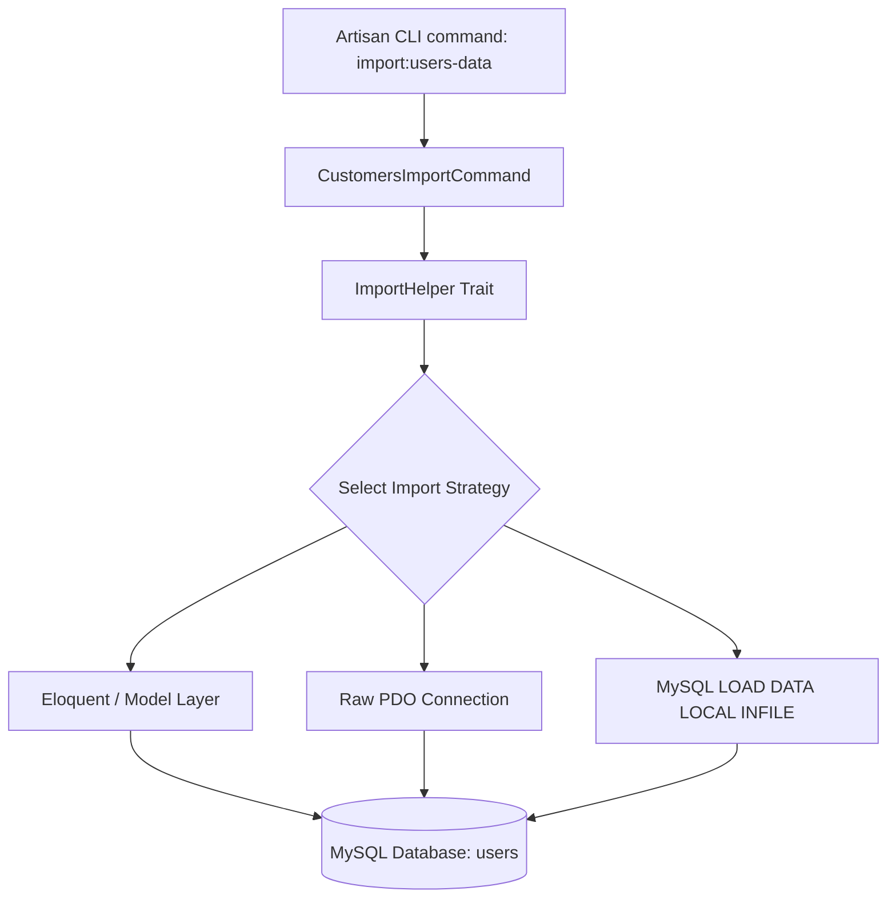

# AGENTS.md

This file serves as a comprehensive, deep-dive reference for AI agents (Codex, Gemini, Copilot) in future development sessions. It outlines the codebase architecture, features, database conventions, dependencies, setup instructions, and critical constraints of the **Laravel Bulk Import Strategies** project.

---

## Project Overview

### App Purpose
The project is a high-performance **benchmark playground and sandbox** designed to demonstrate, analyze, and compare various strategies for importing extremely large datasets (ranging from 100 to 2 million rows) from CSV files into a MySQL database. It monitors execution time, peak memory usage, executed SQL query counts, and database rows inserted to evaluate strategies ranging from basic Eloquent loops to native database file-loading engines.

### Main Modules & Features
- **Artisan Console Command (`import:users-data`)**: The primary execution entrypoint. It runs interactively in the terminal and leverages Laravel Prompts (`select`) to select datasets and trigger the configured bulk import strategy.
- **Import Strategies Engine (`ImportHelper` Trait)**: Contains 12 discrete, granular methodologies for file streaming and database ingestion.
- **Git LFS Mock Datasets (`public/csv_files/`)**: Standardized CSV test files containing mock user profiles:
  - `users-100.csv` (100 rows)
  - `users-1k.csv` (1,000 rows)
  - `users-10k.csv` (10,000 rows)
  - `users-100k.csv` (100,000 rows)
  - `users-1m.csv` (1,000,000 rows)
  - `users-2m.csv` (2,000,000 rows - ~224 MB, stored in Git LFS)
- **Web Interface Sandbox**: This is not currently a full web product. The web surface is Laravel's default welcome page at `/`; there are no custom API endpoints, form workflows, dashboards, or SEO modules.

### Core Benchmarking Logic
Every execution automatically executes benchmark instrumentation (`startBenchmark()` and `endBenchmark()`):
1. **Starts tracking**:
   - Records starting row count (`DB::table('users')->count()`).
   - Captures microtime (`microtime(true)`).
   - Captures baseline PHP memory usage (`memory_get_usage()`).
   - Enables the Laravel query log and queries total session SQL commands via `SHOW SESSION STATUS LIKE 'Questions'`.
2. **Finishes tracking**:
   - Computes elapsed execution time (formatted into milliseconds, seconds, or minutes).
   - Computes PHP memory delta (`MB`).
   - Subtracts benchmark queries to compute total SQL queries executed.
   - Calculates the net rows inserted.
   - Displays a styled terminal banner:
     `⚡ TIME: <time> MEM: <memory>MB SQL: <query_count> ROWS: <inserted_count>`

---

## Tech Stack

- **Framework**: Laravel `^12.0` (using Laravel 12 anonymous migration and modern single-file bootstrapping).
- **Runtime**: PHP `^8.2`.
- **Database Engine**: MySQL / MariaDB (requires `local-infile` support for bulk strategies). SQLite exists as the default/testing fallback.
- **Caching Layer**: Database cache store by default, backed by standard `cache` and `cache_locks` migrations.
- **Queueing Engine**: Configured to run asynchronously via standard `database` driver (backed by `jobs`, `job_batches`, and `failed_jobs` migrations; no application jobs are currently defined).
- **Frontend Stack**:
  - Blade template files only (no Vue, React, or Inertia).
  - TailwindCSS `v4.0.0` (integrated using the new `@tailwindcss/vite` compiler).
  - Axios `^1.8.2` (bootstrapped globally in `resources/js/bootstrap.js`).
- **Key Dev Dependencies**:
  - `pestphp/pest ^3.8` (testing framework).
  - `laravel/sail ^1.41` (Docker environment).
  - `laravel/pail ^1.2.2` (interactive log tailing).
  - `laravel/tinker ^2.10.1` (interactive REPL).
  - `laravel/pint ^1.13` (code styler).
- **Third-Party Services**: Only default Laravel service config stubs for Mail/Postmark/Resend/AWS/Slack; none are used by application code.

---

## Architecture Summary

### Project Structure
The application uses a standard Laravel directory layout, but is heavily streamlined around a single-responsibility CLI domain:



### Dependency Flow
1. **Trigger**: Developer runs `php artisan import:users-data`.
2. **Bootstrap**: Laravel maps commands via routing. `CustomersImportCommand` uses the `ImportHelper` trait.
3. **Execution**:
   - The CLI prompt asks the user to select a target file size.
   - The command invokes `handleImport($filePath)`.
   - The selected strategy reads data from `/public/csv_files/`.
   - Records are mapped and written to the database using one of the 12 strategies.
   - The console prints final system telemetry metrics.

### Design Patterns
- **No Service/Repository Layer**: There is no service/repository layer, no DTOs, no request validators, no events/listeners, no policies/gates, and no API response abstraction currently in place.
- **Active Path vs. Experimental Methods**:
  - The active command path in `CustomersImportCommand::handleImport()` implements the MySQL `LOAD DATA LOCAL INFILE` strategy. Most earlier strategies are preserved as commented blocks for study.
  - The `ImportHelper` trait contains the 12 standalone private benchmark strategies `import01...import12`. These are not actively selected in the console unless `handleImport()` is manually modified to route to them.

---

## The 12 Import Strategies Detailed

The `ImportHelper` trait defines 12 distinct strategies that represent an incremental optimization journey:

| Method / Strategy | Concept | Performance Profile | Bottlenecks & Limitations |
| :--- | :--- | :--- | :--- |
| **01. Basic One-by-One** | `User::create()` on each row parsed via `file($path)`. | Extremely slow. Runs $N$ distinct queries. | Memory limits exhausted at >100K rows (file read); heavy DB connection roundtrip overhead. |
| **02. Collect and Insert** | Reads entire file into collection, maps, calls `User::insert()`. | Very fast for tiny sets. | MySQL limit: prepared statement fails at >65,535 total placeholders ($N \times \text{columns}$). |
| **03. Collect and Chunk** | Reads entire file, maps, chunks by 1,000, inserts in batch. | Fast (e.g. 100K rows in ~2.6s). | Memory exhausted at 1M rows due to reading the entire file into a PHP array using `file()`. |
| **04. Lazy Collection** | Line-by-line reading using PHP Generator and individual inserts. | 0MB memory overhead. | Extremely slow execution time; runs $N$ database writes. |
| **05. Lazy Chunking** | PHP Generator reads line-by-line, chunked by 1,000, batched inserts. | Balanced memory/time. | Minor Eloquent model instantiation memory spikes. |
| **06. Lazy Chunking + PDO** | Same as #5, but executes raw SQL query via standard raw PDO prepared statements. | Exceptionally fast; 0.23MB memory. | Requires manual raw SQL placeholder compilation and mapping. |
| **07. Manual Streaming** | Standard `fopen` and `fgetcsv` streams, chunks of 1,000 written via `User::insert()`. | Traditional, stable memory profile. | Eloquent query building memory overhead. |
| **08. Manual Stream + PDO** | Standard stream chunking with manually prepared SQL statements via raw PDO. | Exceptionally fast (1M rows in ~28s), very low memory. | Increased complexity; raw SQL syntax. |
| **09. Row-by-Row PDO** | `fopen` with persistent raw PDO single-statement execution. | Stable memory. | Slow execution due to row-by-row queries. |
| **10. PDO Prepared Chunked** | Reuses a static PDO statement sized exactly to the chunk size ($C = 500$). | Extremely high performance (1M rows in ~15s). | Highly rigid (remaining records must compile a smaller custom statement). |
| **11. Concurrent (Fibers)** | Launches concurrent PHP child processes ($P = 10$) using Laravel Concurrency. Lines mapped modulo process index. | High CPU utilizing parallel inserts (1M rows in ~4.3s). | Increased DB connection limits; heavy CPU context switching. |
| **12. MySQL Load Infile** | Native MySQL `LOAD DATA LOCAL INFILE` bypassing PHP mapping entirely. | Maximum performance: 2M rows in ~11s, 0MB PHP overhead. | Requires special global server configuration and security settings. |

---

## Folder Structure Explanation

- **`app/Console/Commands/`**:
  - `CustomersImportCommand.php`: Defines the CLI console options and implements the active bulk import strategy (`handleImport()`).
- **`app/Http/`**:
  - `Middleware/TestMiddleware.php`, `Requests/TestRequest.php`, `Policies/TestPolicy.php`: Inactive scaffoldings.
- **`app/ImportHelper.php`**:
  - Contains database benchmarking wrappers and detailed implementations for the 12 strategies.
- **`app/Models/User.php`**:
  - Core database Eloquent model extended with `company`, `city`, `country`, and `birthday` fillable attributes.
- **`app/Providers/`**:
  - `AppServiceProvider.php`: Global provider setting `Schema::defaultStringLength(191)` for database index compatibility.
- **`database/migrations/`**:
  - `0001_01_01_000000_create_users_table.php`: Core migration creating standard user schemas.
  - `0001_01_01_000001_create_cache_table.php`, `0001_01_01_000002_create_jobs_table.php`: Skeleton table migrations for queue and cache handling.
- **`public/csv_files/`**:
  - Hosts datasets tracked by Git LFS pointers.
- **`routes/`**:
  - `web.php`: Standard web routes (only `/` returning the welcome Blade view).
  - `api.php`: Standard API routes (only standard user profile stubs with Sanctum).
  - `console.php`: Default Artisan console closures (e.g. `inspire`).
- **`resources/`**:
  - Holds Blade layouts and assets parsed by Vite.
  - `resources/css/app.css` & `resources/js/app.js`: CSS and JavaScript entrypoints.
- **`tests/`**:
  - Pest test suites (`Feature/ExampleTest.php`, `Unit/ExampleTest.php`). Existing tests are Laravel skeleton smoke tests only.

---

## Coding Conventions

### Naming Conventions
- **Artisan Commands**: Defined in kebab-case format (e.g. `import:users-data`).
- **Optimization Strategy Methods**: Numbered, descriptive camelCase strategies (e.g. `import01BasicOneByOne`, `import11Concurrent`).
- **Models**: Singular StudlyCase, conforming to Eloquent conventions (`User`).
- **Controllers/Services**: Traditional StudlyCase (`TestClass`), though not actively utilized in core benchmark flows.

### Validation Patterns
- **Programmatic & Inline**: Validation is inline and programmatic within high-volume pipelines rather than leveraging `FormRequest` classes, minimizing class instantiation overhead:
  ```php
  filter_var($row[2], FILTER_VALIDATE_EMAIL)
  ```
- **Future HTTP Integrations**: If adding HTTP features, prefer Laravel `FormRequest` classes rather than inline validation.

### Response Patterns
- Outputs are rendered purely to terminal standard output using high-visibility terminal banners:
  ```php
  $this->line(sprintf('⚡ <bg=bright-blue;fg=black> TIME: %s </> ...', $formattedTime));
  ```
- No established JSON response patterns. If adding APIs, introduce a small, consistent response structure first.

---

## Authentication & Authorization

- **Structure**: Currently non-functional scaffoldings.
- **API Guard**: Out-of-the-box Laravel Sanctum config (`auth:sanctum` configured in `routes/api.php`).
- **Web Guard**: Default session guard using the `App\Models\User` provider.
- **Middleware**: Defaults mapped inside `bootstrap/app.php` with placeholder `TestMiddleware`.
- **Import Commands Behavior**: Bulk imports intentionally bypass authentication, model events, observers, casts, password hashing, and normal validation rules to ensure maximum performance.

---

## Database Conventions

### Migration Patterns
- Standard Laravel anonymous migrations. 
- `AppServiceProvider` explicitly configures `Schema::defaultStringLength(191)` in `boot()`, likely for older MySQL index compatibility.

### Constraint Limits
- **Unique Emails**: The `users.email` column is unique. Large imports with duplicate emails will trigger a fatal database error unless they are cleaned beforehand or the SQL statement uses deduplication/upsert behavior (e.g. `INSERT IGNORE` or `ON DUPLICATE KEY UPDATE`).
- **Eloquent Hydration Overhead**: High-performance paths bypass Eloquent entirely; do not expect model casts, events, or mutators to run during bulk SQL executions.

### Important Tables
- **`users`**: Target bulk load database table.
  ```sql
  CREATE TABLE `users` (
    `id` bigint(20) unsigned NOT NULL AUTO_INCREMENT,
    `name` varchar(255) DEFAULT NULL,
    `email` varchar(255) NOT NULL UNIQUE,
    `company` varchar(255) DEFAULT NULL,
    `city` varchar(255) DEFAULT NULL,
    `country` varchar(255) DEFAULT NULL,
    `birthday` date DEFAULT NULL,
    `email_verified_at` timestamp NULL DEFAULT NULL,
    `password` varchar(255) NOT NULL,
    `remember_token` varchar(100) DEFAULT NULL,
    `created_at` timestamp NULL DEFAULT NULL,
    `updated_at` timestamp NULL DEFAULT NULL,
    PRIMARY KEY (`id`)
  );
  ```

---

## Cache / Queue / Jobs

- **Queue Driver**: Standard `database` queue. Jobs are pushed to a central `jobs` queue table (configured but currently not utilized in the core benchmark flow as the import is fully synchronous or fiber-concurrent).
- **Cache Storage**: Configured to write to the `cache` database table.
- **Async & Parallel Execution**: Powered by **Laravel Concurrency** (utilizes the PHP CLI `process` driver under the hood). Spins up multiple isolated PHP workers running concurrently to parallelize imports.
- **Developer Script**: The Composer `dev` script automatically starts a queue listener (`php artisan queue:listen --tries=1`), but the codebase currently has no jobs to process.

---

## Frontend & SEO

- **Rendering**: Static server-rendered Blade template (`welcome.blade.php`).
- **Styling**: TailwindCSS **v4.0.0** compiled using the `@tailwindcss/vite` plugin.
- **JavaScript**: Minimal Axios instantiation inside standard `resources/js/app.js`. `resources/js/bootstrap.js` binds Axios on `window.axios` with default `X-Requested-With` headers.
- **SEO/Meta**: Standard HTML layout, no dedicated dynamic SEO management libraries. Uses only minimal default HTML tags (charset, viewport, title, and Bunny font preconnect). No Open Graph tags, sitemaps, or structured data exist.

---

## Environment & Local Development

### Critical Environment Variables (`.env`)
- `DB_DATABASE=import_million_rows`
- `MYSQL_ATTR_LOCAL_INFILE=true` (Required by the client PDO driver to run the native LOAD DATA LOCAL INFILE strategy).

### Typical Setup Steps
1. Clone repository and run `composer install` & `npm install`.
2. Copy configuration: `cp .env.example .env` and generate key `php artisan key:generate`.
3. Create target MySQL database `import_million_rows`.
4. Run migrations: `php artisan migrate`.
5. Populate CSV assets (run `git lfs pull` to download real mock files).

### CLI Dev Commands (Configured in `composer.json`)
- **Run local development concurrently**:
  ```bash
  composer dev
  ```
  *(Spins up Laravel web server, queue listener, and Vite compiler concurrently using `npx concurrently`)*.
- **Run test suites**:
  ```bash
  composer test
  ```
- **Run artisan commands**:
  ```bash
  php artisan import:users-data
  ```

---

## Testing & Debugging

- **Testing Engine**: Powered by **Pest PHP**.
- **Testing Database Configuration**: `phpunit.xml` routes tests to an in-memory SQLite database, using `array` for caches/sessions and `sync` for queues.
- **Log Management**: Laravel Pail (`php artisan pail`) is integrated to easily tail incoming application errors in real-time.
- **Error Display**: Configured inline within benchmarking tasks to dump complete exception profiles:
  ```php
  error_reporting(E_ALL);
  ini_set('display_errors', 1);
  ```
- **Benchmark Database Specifics**: Telemetry relies on MySQL-specific `SHOW SESSION STATUS LIKE 'Questions'`; this calculation will fail or return invalid metrics on SQLite/PostgreSQL.

---

## Important Constraints & Risky Areas (CRITICAL FINDINGS)

> [!WARNING]
> **1. Trailing Comma in Command Query (Syntax Error)**
> Inside `CustomersImportCommand.php` (line 491), the query executing `LOAD DATA LOCAL INFILE` terminates with a trailing comma in the `SET` block:
> ```sql
> SET
>     name = @col1,
>     email = @col2,
>     company = @col3,
>     city = @col4,
>     country = @col5,
>     birthday = @col6,
>     password = 'default_hashed_password',
> ```
> This trailing comma **will cause a fatal MySQL syntax exception** during execution. The comma must be removed if this strategy is executed.

> [!IMPORTANT]
> **2. Column Mismatch: `custom_id`**
> Several benchmarking methods in `ImportHelper.php` (e.g. `import06LazyCollectionWithChunkingAndPdo`, `import08ManualStreamingWithPdo`, `import10PDOPreparedChunked`, `import12LoadDataInfile`) reference a database column named `custom_id` in their raw SQL INSERT definitions:
> ```sql
> INSERT INTO users (custom_id, name, email, ...) VALUES ...
> ```
> However, the `users` table migration **does not contain a `custom_id` column**. Running these raw SQL import strategies directly will trigger a database exception: `Column not found: 1054 Unknown column 'custom_id'`.
> *Resolving this requires adding a `$table->unsignedBigInteger('custom_id')->nullable();` field to the users table migration, or removing it from the SQL lists.*

> [!CAUTION]
> **3. MySQL LOAD DATA Security Constraints**
> Performing native imports via MySQL `LOAD DATA LOCAL INFILE` requires strict configuration privileges:
> - **Database Server**: Must be configured with global variable `local_infile = 1` inside `my.cnf`/`my.ini`, or enabled globally via database administration client (`SET GLOBAL local_infile = 1;`).
> - **Application PDO Client**: Requires the driver setting `MYSQL_ATTR_LOCAL_INFILE=true` to be set in the database connection array, or configured in the environment variables.

> [!NOTE]
> **4. Git LFS Pointer Resolution**
> Large mock CSV files inside `public/csv_files/` are managed via Git LFS. If the local workspace has only the small pointer text files (e.g. 130 bytes), running the import tool will parse the LFS text metadata instead of actual rows. Ensure `git lfs pull` is run during setup to download the complete datasets.

> [!CAUTION]
> **5. Database Truncation Behavior**
> Running `php artisan import:users-data` invokes `User::truncate()` immediately before execution. This deletes all existing rows from the `users` table. Never run this benchmark command against any database with persistent data that must be preserved.

---

## Recommended Workflow For Future Codex Sessions

### Preferred Implementation Style
1. **Raw Database Layering**: For high-performance modifications, utilize raw PDO prepared statements chunked cleanly (matching the patterns in `import08` and `import10`). Avoid standard Eloquent model instantiations for sets exceeding 10,000 entries to prevent memory allocation overhead.
2. **Deterministic Telemetry Logging**: If you write new import variations, wrap them in the `startBenchmark()` and `endBenchmark()` methods defined inside the `ImportHelper` trait to maintain uniform telemetry logging output.
3. **Database Migration Safety**: Before executing or testing bulk import scripts, verify if the targeted columns (specifically `custom_id`) are actively registered in the current active database schema.

### Safe Refactoring Strategy
- **Step 1**: Run `composer test` to confirm environment variables are loaded and PHP/Vite configurations compile successfully.
- **Step 2**: If testing high-volume inserts, verify memory caps in php.ini are sufficient, or run with the smallest dataset first (`users-100.csv` or `users-1k.csv`) to validate statement syntax before triggering multi-million row processing.
- **Step 3**: When debugging SQL generation, view queries via raw query logging or tail log errors using Laravel Pail:
  ```bash
  php artisan pail
  ```
- **Step 4: Keep Changes Narrow**: This project is a dedicated performance benchmark sandbox. Avoid introducing persistent models, HTTP controllers, repositories, queues, or frontend widgets unless specifically requested by the user.
